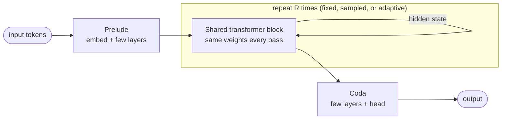
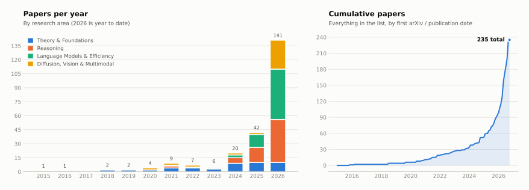
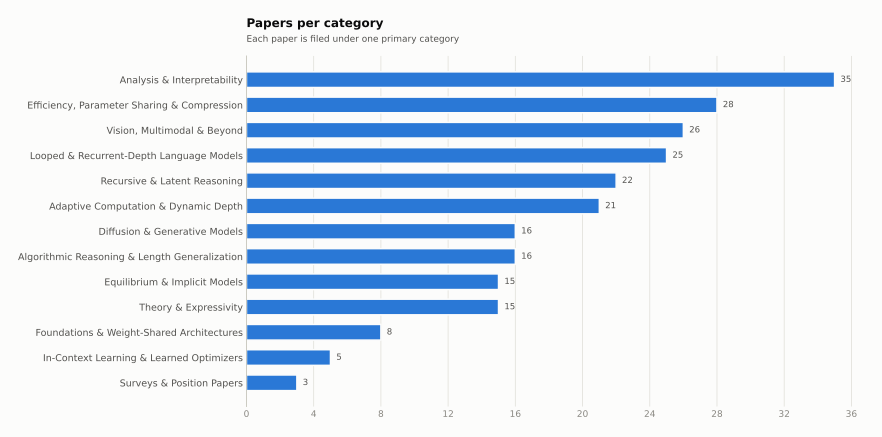

<!-- This file is generated by scripts/build_readme.py. Edit data/*.yaml or templates/ instead. -->
<div align="center">


# Awesome Looped Transformers

**A curated, auto-updated list of research on looped, recurrent-depth and weight-tied transformers:<br>
models that get deeper by running the same block again.**

[](https://awesome.re)
[](#-papers)
[](#-progress-tracker)
[](CONTRIBUTING.md)
[](https://github.com/shreshthsaini/Rough-Claude-Cloud/commits)
[](https://github.com/shreshthsaini/Rough-Claude-Cloud/stargazers)
[](LICENSE)

**[📝 Add a paper](https://github.com/shreshthsaini/Rough-Claude-Cloud/issues/new?template=add-paper.yml)** ·
**[🔗 Add a resource](https://github.com/shreshthsaini/Rough-Claude-Cloud/issues/new?template=add-resource.yml)** ·
**[🐛 Report a mistake](https://github.com/shreshthsaini/Rough-Claude-Cloud/issues/new?template=fix-entry.yml)**

<sub>2 papers · 13 categories · 2018–2025 · newest paper 2025-02-07 · star counts refreshed daily</sub>

</div>

---

## 🔄 What is a looped transformer?

A standard transformer stacks *L* distinct layers. A **looped** (a.k.a. *recurrent-depth*, *universal*,
*weight-tied* or *recursive*) transformer instead applies **one shared block (or a small stack) R times**,
feeding its output back in as input. Depth becomes a knob you can turn at inference time, parameters stay
fixed, and the model can "think longer" in its hidden state instead of in generated tokens.



This list tracks the whole family: the original **Universal Transformer**, the **theory** of what loops can
express, **algorithmic and latent reasoning** (HRM, TRM, Deep Thinking), **looped LLMs** at scale (Huginn,
Ouro, Mixture-of-Recursions), **adaptive depth**, **compression** of pretrained models into recursive
ones, **looped diffusion and vision** backbones, and their infinite-depth cousins, **deep equilibrium
models**.

## 📑 Contents

- [What is a looped transformer?](#-what-is-a-looped-transformer)
- [Recently added](#-recently-added)
- [Progress tracker](#-progress-tracker)
- [Papers](#-papers)
  - [Surveys & Position Papers](#-surveys--position-papers)
  - [Foundations & Weight-Shared Architectures](#-foundations--weight-shared-architectures)
  - [Theory & Expressivity](#-theory--expressivity)
  - [In-Context Learning & Learned Optimizers](#-in-context-learning--learned-optimizers)
  - [Algorithmic Reasoning & Length Generalization](#-algorithmic-reasoning--length-generalization)
  - [Recursive & Latent Reasoning](#-recursive--latent-reasoning)
  - [Looped & Recurrent-Depth Language Models](#-looped--recurrent-depth-language-models)
  - [Adaptive Computation & Dynamic Depth](#-adaptive-computation--dynamic-depth)
  - [Efficiency, Parameter Sharing & Compression](#-efficiency-parameter-sharing--compression)
  - [Diffusion & Generative Models](#-diffusion--generative-models)
  - [Vision, Multimodal & Beyond](#-vision-multimodal--beyond)
  - [Equilibrium & Implicit Models](#-equilibrium--implicit-models)
  - [Analysis & Interpretability](#-analysis--interpretability)
- [Contributing](#-contributing)
- [Star history](#-star-history)
- [Citation](#-citation)

## 🆕 Recently added

- **2025-02** · [Scaling up Test-Time Compute with Latent Reasoning: A Recurrent Depth Approach](https://arxiv.org/abs/2502.05171) <sub>(arXiv)</sub>
- **2018-07** · [Universal Transformers](https://arxiv.org/abs/1807.03819) <sub>(ICLR 2019)</sub>

## 📈 Progress tracker

<picture>
  <source media="(prefers-color-scheme: dark)" srcset="assets/stats-timeline-dark.svg">
  
</picture>

<details>
<summary><b>Papers per category</b> (chart + table)</summary>

<picture>
  <source media="(prefers-color-scheme: dark)" srcset="assets/stats-categories-dark.svg">
  
</picture>

| Category | Papers | With code | Newest |
|:---|:---:|:---:|:---:|
| 📚 [Surveys & Position Papers](#-surveys--position-papers) | 0 | 0 | — |
| 🧱 [Foundations & Weight-Shared Architectures](#-foundations--weight-shared-architectures) | 1 | 1 | 2018-07 |
| 📐 [Theory & Expressivity](#-theory--expressivity) | 0 | 0 | — |
| 🔁 [In-Context Learning & Learned Optimizers](#-in-context-learning--learned-optimizers) | 0 | 0 | — |
| 🧮 [Algorithmic Reasoning & Length Generalization](#-algorithmic-reasoning--length-generalization) | 0 | 0 | — |
| 🧠 [Recursive & Latent Reasoning](#-recursive--latent-reasoning) | 0 | 0 | — |
| 💬 [Looped & Recurrent-Depth Language Models](#-looped--recurrent-depth-language-models) | 1 | 1 | 2025-02 |
| ⏱️ [Adaptive Computation & Dynamic Depth](#-adaptive-computation--dynamic-depth) | 0 | 0 | — |
| ⚡ [Efficiency, Parameter Sharing & Compression](#-efficiency-parameter-sharing--compression) | 0 | 0 | — |
| 🎨 [Diffusion & Generative Models](#-diffusion--generative-models) | 0 | 0 | — |
| 👁️ [Vision, Multimodal & Beyond](#-vision-multimodal--beyond) | 0 | 0 | — |
| ♾️ [Equilibrium & Implicit Models](#-equilibrium--implicit-models) | 0 | 0 | — |
| 🔬 [Analysis & Interpretability](#-analysis--interpretability) | 0 | 0 | — |
| **Total** | **2** | **2** | |

**By type:** `Method` 1 · `Model` 1

</details>

<details>
<summary><b>🔥 Most-starred implementations</b></summary>

| # | Paper | Repository | Stars |
|:---:|:---|:---|:---:|
| 1 | [Scaling up Test-Time Compute with Latent Reasoning: A Recurrent Depth Approach](https://arxiv.org/abs/2502.05171) | [seal-rg/recurrent-pretraining](https://github.com/seal-rg/recurrent-pretraining) | 800 |

</details>

<sub>Charts and counts are regenerated automatically by GitHub Actions on every change to <code>data/papers.yaml</code>.</sub>

## 📄 Papers

Each table is sorted newest first. **Type** is one of `Method`, `Theory`, `Analysis`, `Survey`,
`Benchmark`, `Model` or `Position`. The **Code** column shows live GitHub stars for the official
implementation.

### 📚 Surveys & Position Papers

> Overviews of looped, recurrent-depth and latent-reasoning models, plus opinionated position pieces.

_No papers yet. [Add the first one!](#-contributing)_

### 🧱 Foundations & Weight-Shared Architectures

> The architectures that started it all. Universal Transformers, cross-layer sharing, and looped blocks as a design primitive.

| Date | Paper | Venue | Type | Code |
|:---:|:---|:---:|:---:|:---:|
| 2018-07 | **[Universal Transformers](https://arxiv.org/abs/1807.03819)**<br><sub>Mostafa Dehghani, Stephan Gouws, Oriol Vinyals et al.</sub><br><sub>💡 Applies one transformer block recurrently over depth with adaptive halting.</sub><br><sub>[Paper](https://arxiv.org/abs/1807.03819)</sub> | ICLR 2019 | `Method` | [](https://github.com/tensorflow/tensor2tensor) |

<div align="right"><a href="#-contents">⬆ back to top</a></div>

### 📐 Theory & Expressivity

> What can a looped transformer compute? Expressivity, Turing completeness, CoT equivalence, approximation and training dynamics.

_No papers yet. [Add the first one!](#-contributing)_

### 🔁 In-Context Learning & Learned Optimizers

> Looped transformers that implement gradient descent and other iterative learning algorithms in context.

_No papers yet. [Add the first one!](#-contributing)_

### 🧮 Algorithmic Reasoning & Length Generalization

> Thinking longer to solve harder instances. Arithmetic, graphs, puzzles and easy-to-hard extrapolation.

_No papers yet. [Add the first one!](#-contributing)_

### 🧠 Recursive & Latent Reasoning

> Reasoning in hidden state instead of tokens. HRM, TRM, latent thoughts and iterative refinement.

_No papers yet. [Add the first one!](#-contributing)_

### 💬 Looped & Recurrent-Depth Language Models

> Pretraining, scaling and test-time compute for looped LLMs such as Huginn, Ouro and Mixture-of-Recursions.

| Date | Paper | Venue | Type | Code |
|:---:|:---|:---:|:---:|:---:|
| 2025-02 | **[Scaling up Test-Time Compute with Latent Reasoning: A Recurrent Depth Approach](https://arxiv.org/abs/2502.05171)**<br><sub>Jonas Geiping, Sean McLeish, Neel Jain et al.</sub><br><sub>💡 Pretrains a 3.5B recurrent-depth LM whose shared core block can be iterated more at test time to scale reasoning compute.</sub><br><sub>[Paper](https://arxiv.org/abs/2502.05171)</sub> | arXiv | `Model` | [](https://github.com/seal-rg/recurrent-pretraining) |

<div align="right"><a href="#-contents">⬆ back to top</a></div>

### ⏱️ Adaptive Computation & Dynamic Depth

> Deciding how many loops to run. Halting, pondering, routing tokens to different recursion depths, early exit.

_No papers yet. [Add the first one!](#-contributing)_

### ⚡ Efficiency, Parameter Sharing & Compression

> Doing more with fewer parameters. Recursive conversion of pretrained LLMs, layer tying, KV sharing and fast inference.

_No papers yet. [Add the first one!](#-contributing)_

### 🎨 Diffusion & Generative Models

> Looped and recurrent-depth backbones for diffusion, flow matching, diffusion LMs and other generative models.

_No papers yet. [Add the first one!](#-contributing)_

### 👁️ Vision, Multimodal & Beyond

> Looped ViTs, recurrent-depth multimodal models, video, speech and robotics.

_No papers yet. [Add the first one!](#-contributing)_

### ♾️ Equilibrium & Implicit Models

> The infinite-loop limit. Deep equilibrium models and fixed-point transformers.

_No papers yet. [Add the first one!](#-contributing)_

### 🔬 Analysis & Interpretability

> What happens inside the loop. Probing, mechanistic studies, failure modes and empirical comparisons.

_No papers yet. [Add the first one!](#-contributing)_


## 🧰 Resources


## 🤝 Contributing

Contributions are very welcome, and the fastest path is fully automated:

1. **[Open an "Add a paper" issue](https://github.com/shreshthsaini/Rough-Claude-Cloud/issues/new?template=add-paper.yml)**
   and paste an arXiv link. Everything else is optional.
2. A bot fetches the **title, authors, date, venue and code link** from arXiv, files it in the category you
   picked, regenerates this README and the charts, and **opens a pull request** for you.
3. A maintainer reviews and merges. Done.

Maintainers can also add a paper from any issue or PR comment with
`/add-paper <arxiv-id-or-url> <category> [type]`. A weekly job scans arXiv for new looped-transformer papers
and opens a triage issue with candidates.

Prefer editing by hand? Add an entry to [`data/papers.yaml`](data/papers.yaml) and open a PR; CI
validates it and the README is rebuilt on merge. See **[CONTRIBUTING.md](CONTRIBUTING.md)** for the field
reference and inclusion criteria.

## ⭐ Star history

<a href="https://star-history.com/#shreshthsaini/Rough-Claude-Cloud&Date">
  <picture>
    <source media="(prefers-color-scheme: dark)" srcset="https://api.star-history.com/svg?repos=shreshthsaini/Rough-Claude-Cloud&type=Date&theme=dark">
    
  </picture>
</a>

## 📌 Citation

If this list helps your research, please consider citing it:

```bibtex
@misc{awesome-looped-transformers,
  title        = {Awesome Looped Transformers: A Curated List of Looped, Recurrent-Depth and Weight-Tied Transformer Research},
  author       = {Shreshth Saini and contributors},
  year         = {2026},
  howpublished = {\url{https://github.com/shreshthsaini/Rough-Claude-Cloud}},
  note         = {GitHub repository}
}
```

A machine-readable [`CITATION.cff`](CITATION.cff) is also provided, so GitHub's **"Cite this repository"**
button works too.

## 📜 License

[](https://creativecommons.org/publicdomain/zero/1.0/)

To the extent possible under law, the contributors have waived all copyright and related rights to this
list. Paper titles, abstracts and code belong to their respective authors.
