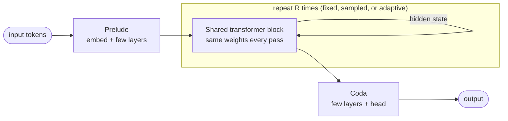

<div align="center">


# Awesome Looped Transformers

**A curated, auto-updated list of research on looped, recurrent-depth and weight-tied transformers:<br>
models that get deeper by running the same block again.**

[](https://awesome.re)
[](#-papers)
[](#-papers)
[](CONTRIBUTING.md)
[](https://github.com/{{REPO}}/commits)
[](https://github.com/{{REPO}}/stargazers)
[](LICENSE)

**[📝 Add a paper](https://github.com/{{REPO}}/issues/new?template=add-paper.yml)** ·
**[🔗 Add a resource](https://github.com/{{REPO}}/issues/new?template=add-resource.yml)** ·
**[🐛 Report a mistake](https://github.com/{{REPO}}/issues/new?template=fix-entry.yml)**

<sub>{{PAPER_COUNT}} papers · {{CATEGORY_COUNT}} categories · {{YEAR_RANGE}} · newest paper {{LAST_PAPER_DATE}}</sub>

</div>

---

## 📑 Table of Contents

{{TOC}}

---

## 🔄 What is a looped transformer?

A standard transformer stacks *L* distinct layers. A **looped** (a.k.a. *recurrent-depth*, *universal*,
*weight-tied* or *recursive*) transformer instead applies **one shared block (or a small stack) R times**,
feeding its output back in as input. Depth becomes a knob you can turn at inference time, parameters stay
fixed, and the model can "think longer" in its hidden state instead of in generated tokens.



This list tracks the whole family: the original **Universal Transformer**, the **theory** of what loops can
express, **recursive reasoning** (HRM, TRM), **looped LLMs** at scale (Huginn, Ouro, Mixture-of-Recursions),
**adaptive depth**, **compression** of pretrained models into recursive ones, **looped diffusion and vision**
backbones, and **fixed-point / equilibrium transformers**.

> **Scope.** Only work where a transformer (or transformer-style) block is **reused across depth with shared
> weights** is listed, plus theory and analysis of such models. Recurrence over time or tokens, recurrent CNNs,
> generic implicit/DEQ layers, energy-based refinement and token-level latent CoT are out of scope.

## 🆕 Recently added

{{NEWS}}

## 📄 Papers

Each table is sorted newest first. **Type** is one of `Method`, `Theory`, `Analysis`, `Survey`,
`Benchmark`, `Model` or `Position`. The **Code** column shows live GitHub stars for the official
implementation.

{{SECTIONS}}

## 🧰 Resources

{{RESOURCES}}

## 🤝 Contributing

Contributions are very welcome, and the fastest path is fully automated:

1. **[Open an "Add a paper" issue](https://github.com/{{REPO}}/issues/new?template=add-paper.yml)**
   and paste an arXiv link. Everything else is optional.
2. A bot fetches the **title, authors, date, venue and code link** from arXiv, files it in the category you
   picked, regenerates this README, and **opens a pull request** for you.
3. A maintainer reviews and merges. Done.

Maintainers can also add a paper from any issue or PR comment with
`/add-paper <arxiv-id-or-url> <category> [type]`. A weekly job scans arXiv for new looped-transformer papers
and opens a triage issue with candidates.

Prefer editing by hand? Add an entry to [`data/papers.yaml`](data/papers.yaml) and open a PR; CI
validates it and the README is rebuilt on merge. See **[CONTRIBUTING.md](CONTRIBUTING.md)** for the field
reference and inclusion criteria.

## 📈 Progress

{{PROGRESS}}

### ⭐ Star history

<a href="https://star-history.com/#{{REPO}}&Date">
  <picture>
    <source media="(prefers-color-scheme: dark)" srcset="https://api.star-history.com/svg?repos={{REPO}}&type=Date&theme=dark">
    
  </picture>
</a>

## 📌 Citation

If this list helps your research, please consider citing it:

```bibtex
@misc{{{CITATION_KEY}},
  title        = {Awesome Looped Transformers: A Curated List of Looped, Recurrent-Depth and Weight-Tied Transformer Research},
  author       = {{{MAINTAINER}}},
  year         = {{{YEAR}}},
  howpublished = {\url{https://github.com/{{REPO}}}},
  note         = {GitHub repository}
}
```

A machine-readable [`CITATION.cff`](CITATION.cff) is also provided, so GitHub's **"Cite this repository"**
button works too.

## 📜 License

[](https://creativecommons.org/publicdomain/zero/1.0/)

To the extent possible under law, the author has waived all copyright and related rights to this
list. Paper titles, abstracts and code belong to their respective authors.
